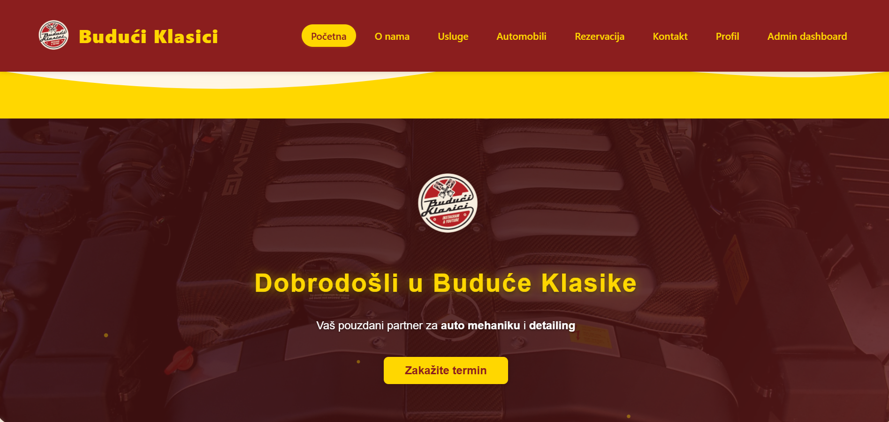
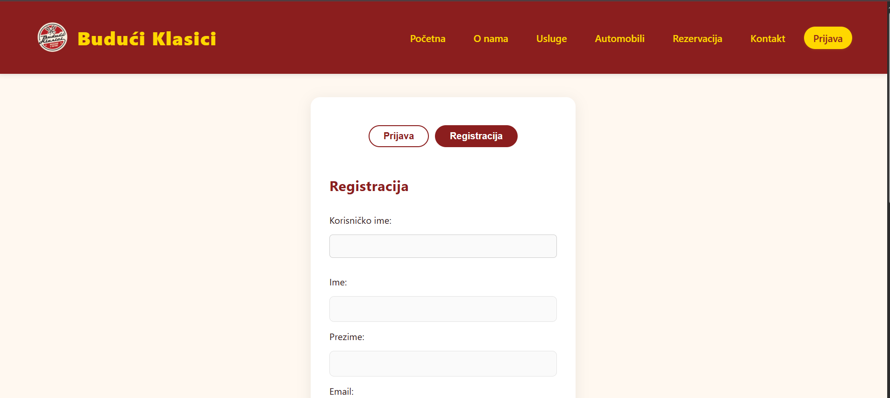
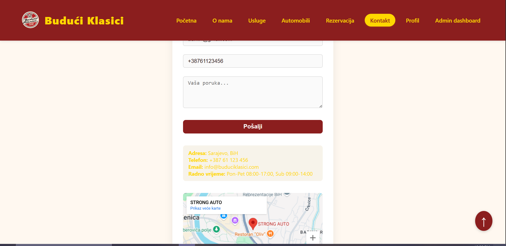
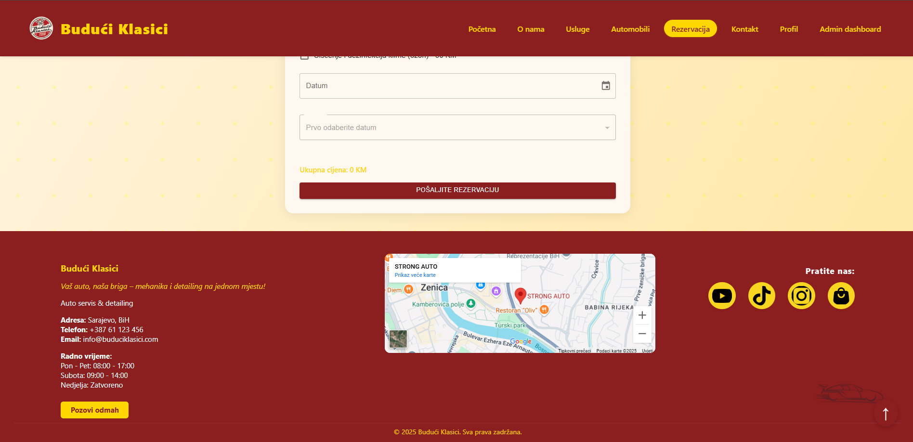
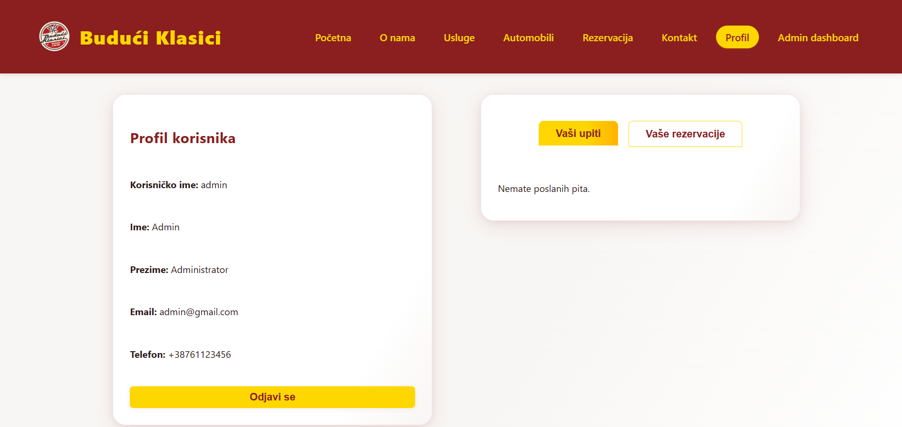
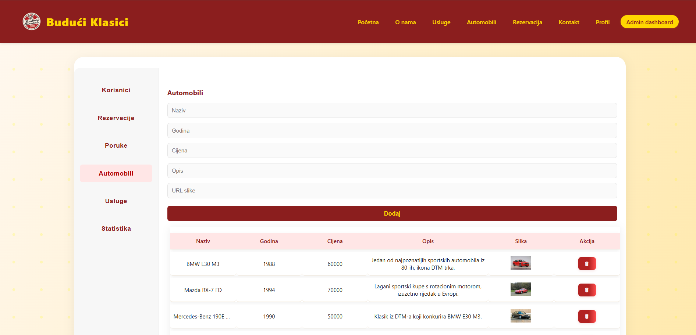

# Budući Klasici

Web aplikacija za auto servis i detailing.

---

## Kratki opis teme

Aplikacija omogućava korisnicima da rezervišu termin za servisiranje vozila, pošalju upit servisu, pregledaju usluge i automobile, te pristupe svom profilu. Admin korisnici imaju dodatne mogućnosti upravljanja korisnicima, uslugama, automobilima, rezervacijama i porukama.

---

## Tehnologije korištene u radu

- React (React Router)
- Material UI (MUI)
- Express (Node.js backend)
- CSS
- date-fns
- json-server (za razvoj/testiranje)
- Google Maps (iframe integracija)

---

## Opis strukture projekta

```
├── 📁 node_modules
├── 📁 public
│   └── 📁 assets
│   └── index.html
├── 📁 screenshots
├── 📁 src
│   ├── 📁 assets
│   ├── 📁 components
│   │   ├── 📁 admin
│   │   │   ├── CarsManager.jsx
│   │   │   ├── MessagesManager.jsx
│   │   │   ├── ReservationsManager.jsx
│   │   │   ├── ServicesManager.jsx
│   │   │   ├── Sidebar.jsx
│   │   │   ├── StatsPanel.jsx
│   │   │   └── UsersManager.jsx
│   │   ├── Footer.js
│   │   ├── Header.js
│   │   ├── LoginForm.js
│   │   ├── ProtectedRoute.js
│   │   └── RegisterForm.js
│   ├── 📁 pages
│   │   ├── About.js
│   │   ├── AdminDashboard.js
│   │   ├── Automobili.js
│   │   ├── Contact.js
│   │   ├── Home.js
│   │   ├── Login.js
│   │   ├── Profil.js
│   │   ├── Reservation.js
│   │   └── Services.js
│   ├── 📁 styles
│   │   ├── About.css
│   │   ├── AdminDashboard.css
│   │   ├── Automobili.css
│   │   ├── Contact.css
│   │   ├── Footer.css
│   │   ├── Header.css
│   │   ├── Home.css
│   │   ├── index.css
│   │   ├── Login.css
│   │   ├── Profil.css
│   │   ├── Reservation.css
│   │   └── Services.css
│   ├── App.js
│   ├── AuthContext.js
│   └── index.js
├── .gitignore
├── db.json
├── Dockerfile
├── package-lock.json
├── package.json
├── README.md
└── server.js

```

---

## Funkcionalnosti i opis dizajna

- Registracija i prijava korisnika (gost/admin)
- Rezervacija termina za servis i detailing (s validacijom)
- Kontakt forma (s validacijom, automatsko popunjavanje za prijavljene korisnike)
- Pregled i filtriranje usluga
- Pregled automobila (galerija, detalji)
- Profil korisnika (pregled upita i rezervacija)
- Admin panel (upravljanje korisnicima, uslugama, automobilima, rezervacijama, porukama)
- Google Maps prikaz lokacije servisa (iframe)
- Responsive dizajn

**Paleta boja:**  
Primarna: #8B1E1E  
Sekundarna: #FFD700  
Pozadina: #FFF8F0  
Kartice: #fff  
Tekst: #2d1c1c  

**Font:**  
'Segoe UI', Tahoma, Geneva, Verdana, sans-serif

---

## Uloge korisnika

- **Gost:** Može pregledati usluge, automobile i kontakt podatke.
- **Registrovani korisnik:** Može rezervisati termin, slati poruke, pregledati svoj profil, upite i rezervacije.
- **Administrator:** Ima sve mogućnosti kao gost, plus pristup admin panelu za upravljanje korisnicima, uslugama, automobilima, rezervacijama i porukama.

---

## Kratki opis doprinosa svakog člana tima

- **Haris**
  - Backend (Express server, API rute, validacija, rad sa bazom, autentikacija, zaštita ruta)
  - Admin panel (CRUD za korisnike, rezervacije, poruke, automobile, usluge)
  - Integracija frontenda i backenda, deployment, testiranje

- **Kenan**
  - Frontend (React komponente, stranice: Početna, O nama, Kontakt, Automobili, Usluge)
  - Responsivan dizajn, stilizacija (CSS, MUI), Google Maps integracija
  - Validacija formi, korisnički profil, prikaz rezervacija i poruka

- **Hamza**
  - Autentikacija i registracija korisnika (login, register, zaštita ruta)
  - Komunikacija sa backendom (fetch, prikaz podataka)
  - Testiranje funkcionalnosti, pisanje dokumentacije, priprema snimaka ekrana

---

## Pokretanje projekta

### 1. Kloniraj repozitorij

```bash
git clone https://github.com/korisnickoime/ime-repozitorija.git
cd ime-repozitorija
```

### 2. Instaliraj zavisnosti

```bash
npm install
```

### 3. Pokreni backend server

```bash
node server.js
```
- Backend koristi `Express` i čita/piše podatke iz `db.json`.
- Server će raditi na [http://localhost:3001](http://localhost:3001).

### 4. Pokreni React aplikaciju (frontend)

```bash
npm start
```
- Frontend će biti dostupan na [http://localhost:3000](http://localhost:3000).

---

## Prijava kao admin ili gost

- **Admin**
  - Email: `admin@gmail.com`
  - Lozinka: `Admin1234`
- **Gost**
  - Email: `gost@gmail.com`
  - Lozinka: `Gost1234`

---

## Snimci ekrana radne aplikacije

<p align="center">
  
</p>
<p align="center">
  
</p>
<p align="center">
  
</p>
<p align="center">
  
</p>
<p align="center">
  
</p>
<p align="center">
  
</p>

> - Početna stranica  
> - Prijava/registracija  
> - Kontakt forma  
> - Rezervacija termina  
> - Profil korisnika  
> - Admin panel  
> - Responsive prikaz

---

Ako imaš pitanja ili naiđeš na problem, slobodno otvori issue na GitHub-u!

